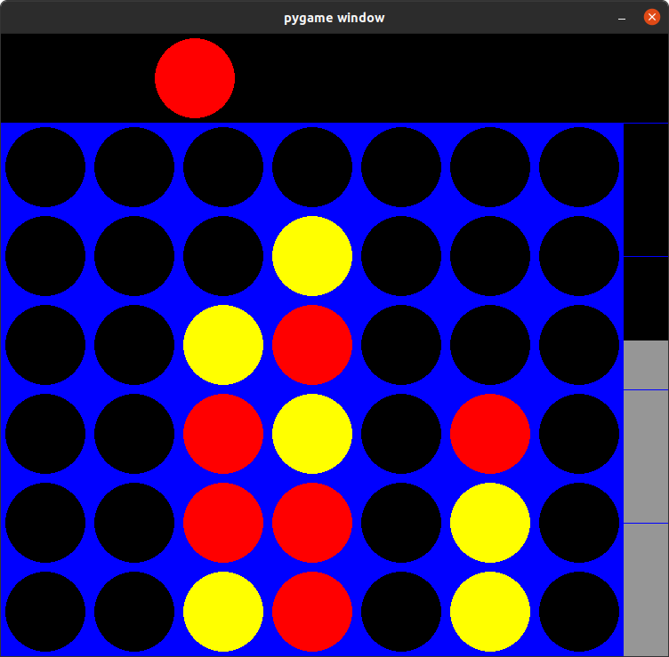

# AlphaConnect4: Combining MCTS and a Neural Evaluator to learn optimal policies through self-play


Connect-4 AI that uses Monte-Carlo Tree Search, and a neural policy and value estimator neural network trained with 
samples generated from self play between previous iterations of the model. The neural augmented MCTS agent is baselined 
with a MCTS + random rollout agent sufficient to beat a strong human with a few seconds of simulations before each move.
A Minimax algorithm with handcrafted heuristics (credits ```KeithGalli```) is also presented as one of the baseline 
agents but does not scale well when confronted with too much depth and is exploitable with a bit of strategy.



### Setup

 - In a new virtual environment, run:

```pip install -r dev_requirements.txt```
 
- (Optional) Change game parameters in `constants/constants.py`
- Modify ```run_game.py``` to setup the game mode and difficulty.

### Parameters

The parameters give control over:

- Number of rows and columns
- Color Scheme + UI parameters
  
In ```run_game.py```, it is possible to choose:

- One player or two player mode
- Type of engine: NeuralMCTS (AlphaConnect4) / Monte-Carlo Tree Search / Minimax
- Path of the model weights for NeuralMCTS
- Strength of the engine (adjust simulation time, or depth for Minimax)
- Display options (visual engine toggle, progress_bar toggle)
- An option to set agents in training mode and specify a path to store generated data

### Interactive play

Once game play constants have been defined, run  ```python run_game.py``` to get started 
with play.

In NeuralMCTS or MCTS play (recommended), the white bar on the right indicates the estimated win
percentage of the player 0. In Minimax play, the bar represents the inverse of a heuristic estimation 
of the position strength of player 1.


### Training a Neural evaluator

Use ```generate_training_data.py``` specifying a training path, and choosing the MCTS type model to use. This will activate training mode, in which agents
choose moves that are not always optimal but rather sampled from the estimated policy with a given temperature during
the first 10 moves. This allows to generate a greater diversity of games and help the neural evaluator learn general 
patterns.

Once enough positions have been generated (up to you, I use 20k+), use `neural_scripts/training_script.py` to train a 
new model to better evaluate position value and optimal policy. You can modify the model structure by replacing the 
NaiveNet or playing with the loss function parameters. It is then possible to play against the new version of the model
by specifying the new weight paths in ```run_game.py```. 

Use the `tournament.py` to pit agents against each other. If the newer neural agent is better than its ancestor 
(DeepMind uses 55 % of wins), use the newer version to regenerate training samples, and reiterate the process for 
serveral generations. 

Note: The tournament mode and the sample generation process can be run in parallel from multiple terminals.

### Results

100 round matchups are simulated between agents (0 for a loss, 1 for a win, 0.5 for a tie), with equal odds
of starting.

| Matchup | Time Control | Result |
|------|----------|---------|
|MCTS vs Minimax | 0.5 sec / depth 4 | 58 - 42 |
|Neural Gen 0 vs MCTS | 0.5 sec | 81.5 - 18.5 |
|Neural Gen 1 vs Minimax | 0.5 sec / depth 4 | 64 - 36 |
|Neural Gen 1 vs MCTS | 0.5 sec | 70 - 30 |
|Neural Gen 1 vs Neural Gen 0 | 0.5 sec | 59 - 41 |
|Neural Gen 2 vs Neural Gen 1 | 0.5 sec | 50.5 - 49.5 |

### Comments

To gain time, the first generation of neural agent (Gen 0) is trained with 50k samples generated from the MCTS agent, rather 
than from a neural network with random weights.

Neural agents gain better positional awareness than their MCTS or Minimax counterpart,
but some generations are susceptible to defend poorly against some
tricky patterns in the opening stage in low time control settings. To prevent this, it is useful to add training samples 
that result from play against older versions of the neural agents or the MCTS agent. 

It might be interesting to modify the loss function to penalize losses in few moves. We could also think of
weighting the MSELoss that corresponds to the win prediction more towards the end of the game and less at the
beginning.

Enjoy ! PRs welcomed ! 

### API

For future web integration, a (WIP) API endpoint is provided, powered by Flask and gunicorn. For the moment,
it needs to be hand configured in the `/api` files but CLI options will be added.

#### Flask
```bash
python api/run_flask.py
```

#### Gunicorn
```bash
 gunicorn "api.run_flask_gunicorn:create_app()" \                  
    --name connect4_backend \
    --bind 0.0.0.0:${GUNICORN_PORT:-8000} \
    --worker-tmp-dir /dev/shm \
    --workers=${GUNICORN_WORKERS:-2} \
    --threads=${GUNICORN_THREADS:-4} \
    --worker-class=gthread \
    --log-level=info \
    --log-file '-' \
    --timeout 300
```
#### Testing the endpoint

To test the endpoint, simply send a post request with the board state:

```python
import requests

r = requests.post("http://127.0.0.1:8000/get_move", json={"board":"0 "*42, "turn":"0"})
print(r.content)
```
